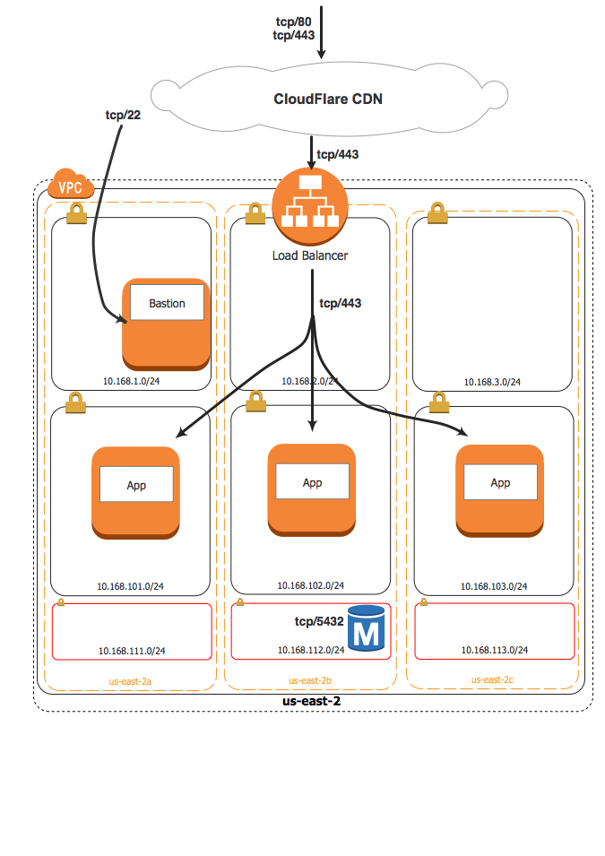

# Introduction to Terraform

This repository is all of the material that was used for [my talk](https://embed.pheedloop.com/dodto19/site/sessions/?id=KzXXQA) at DevOpsDays Toronto 2019.

## Scenario

You -- an intrepid infrastructure engineer -- have been tasked with a green field application project on AWS. The team decided that embracing the codification of infrastructure as well as the applicaiton itself was crucial.

Two crucial problems:
1. Nobody on the team has codified infrastructure before
1. Despite having crafted a bang up whiteboard diagram, going from the picture to code feels like looking over the edge into the abyss.

## End Goal

A fairly standard, "three tier" deployment with a load balancer, pool of app servers, and a database. The load balancer is fronted by the CloudFlare CDN for DDoS protection and caching. There is also a bastion host setup for management and maintenance.

## Requirements

* Terraform 0.12.0+ installed
* An AWS account
  * I've tried my best to use [free tier](https://aws.amazon.com/free/) eligible or low-cost service options

The [AWS provider](https://www.terraform.io/docs/providers/aws/index.html) is currently configured in such a way that it expects your environment to have appropriate [environment variables](https://www.terraform.io/docs/providers/aws/index.html#environment-variables) configured or have setup the AWS CLI with a default or named profile [configured](https://docs.aws.amazon.com/cli/latest/userguide/cli-chap-configure.html).

Note: you are creating real resources that could have real costs. Make sure you clean up your work and don't leave anything running!

## Usage

There is a branch for each "milestone" of the progression toward the desired end state -- branching removes the need of shuffling the state files around between directories (as was done during the presentation).

Begin by switching to the "milestone-1" branch (`git checkout milestone-1` on the CLI), the README.md file will display a diagram of the intended milestone of that iteration.

You'll then need to execute `terraform init` to pull in the needed providers. With that done, `terraform plan` will show you the resources that need to be created. `terraform apply` will create the resources. Continue moving through the branches in sequence (or skip a few ¯\_(ツ)_/¯) and running `init`, `plan` and `apply` to progress through the updates to the infrastructure after taking a look at the diagram for that milestone.

Remember: when you are finished run `terraform destroy` to clean everything up (to avoid unncessary cloud charges).
